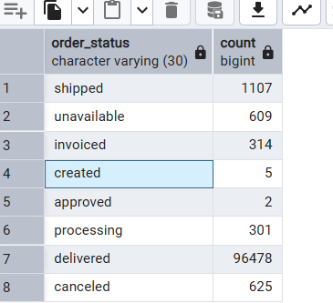
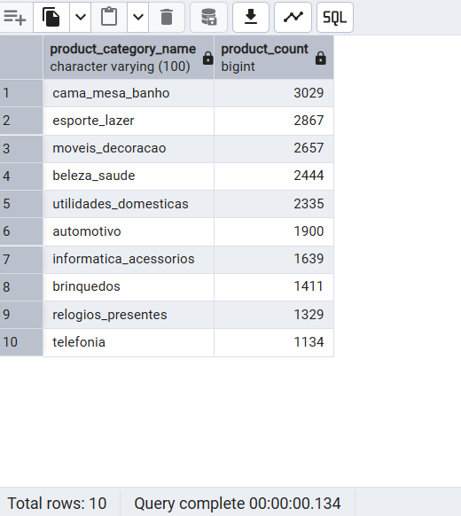
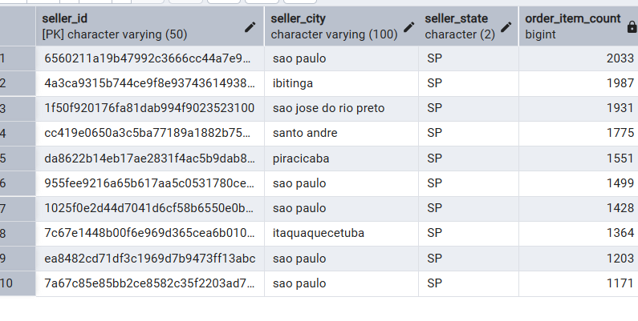
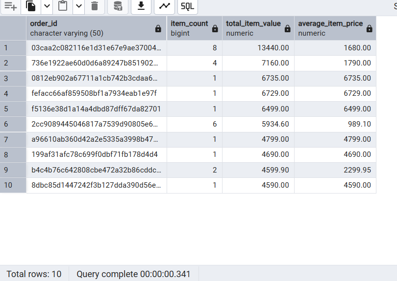
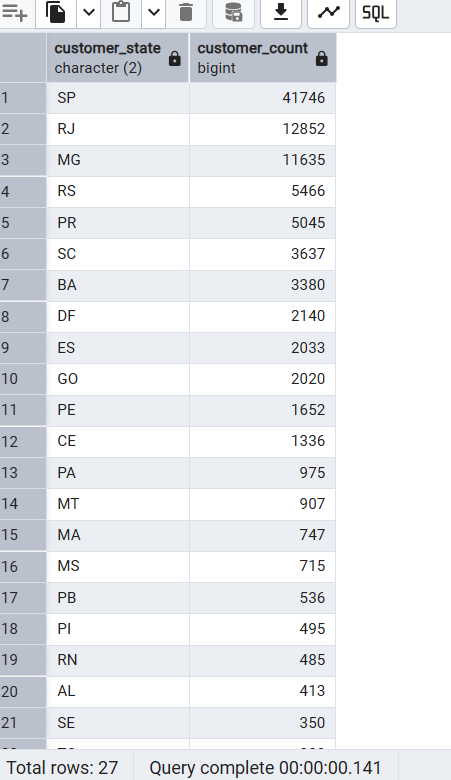

# Data engineering first assignment

**Student name:** Teja  
**Assignment title:** Data engineering first assignment

This project practices Python fundamentals and relational database design using retail examples and the Olist dataset.

## Tools and versions used

| Tool | Version | Purpose |
|---|---|---|
| Python | 3.14.7 | Run the three Python exercises |
| PostgreSQL / psql | 18 / 18.6 client | Store data and execute SQL |
| pgAdmin 4 | 9.17 | Manage tables and import CSV files |


The Python programs use built-in features only; no third-party packages are required.

## How to run the Python programs

Open PowerShell in the project root, `datakern-engineering-foundation`, then run:

```powershell
python python/pr01_retailOrderCalculator.py
python python/pr02_orderValidation.py
python python/pr03_retailSalesSummary.py
```


## Dataset source and files

Source: [Brazilian E-Commerce Public Dataset by Olist on Kaggle](https://www.kaggle.com/datasets/olistbr/brazilian-ecommerce).

The dataset contains anonymised Brazilian e-commerce orders from 2016 to 2018. The local CSV files are stored in:

```text
C:\Users\navya\Downloads\archive
```

The five files used for this assignment are:

| CSV file | Target table |
|---|---|
| `olist_customers_dataset.csv` | `retail.customers` |
| `olist_products_dataset.csv` | `retail.products` |
| `olist_sellers_dataset.csv` | `retail.sellers` |
| `olist_orders_dataset.csv` | `retail.orders` |
| `olist_order_items_dataset.csv` | `retail.order_items` |

## Database and table overview

The documented setup uses a local PostgreSQL database named `retail` and a schema named `retail`. A database and a schema are separate objects; substitute your actual database name when connecting.

| Table | Primary key | Contents and relationships |
|---|---|---|
| `customers` | `customer_id` | Customer identifiers and location |
| `products` | `product_id` | Product category, dimensions, weight, and descriptive attributes |
| `sellers` | `seller_id` | Seller identifiers and location |
| `orders` | `order_id` | Status and timestamps; `customer_id` references customers |
| `order_items` | `(order_id, order_item_id)` | Item price, freight, and shipping deadline; references orders, products, and sellers |

Relationships:

```text
customers  1 ------< orders
orders     1 ------< order_items >------ 1 products
sellers    1 ------< order_items
```

The composite key allows multiple numbered items within each order. Foreign keys require each referenced parent record to exist before its child record is imported.

## How the data was loaded

The loading workflow used during setup was pgAdmin's **Import/Export Data** dialog:

1. Right-click the target table and select **Import/Export Data**.
2. Select **Import** and the corresponding CSV file.
3. Set the format to **csv**, encoding to **UTF8**, delimiter to a comma, and **Header** to **Yes**.
4. Keep the column order aligned with the CSV.
5. Import customers, products, and sellers first, then orders, then order items.


```sql
SELECT 'customers' AS table_name, COUNT(*) AS row_count FROM retail.customers
UNION ALL
SELECT 'products', COUNT(*) FROM retail.products
UNION ALL
SELECT 'sellers', COUNT(*) FROM retail.sellers
UNION ALL
SELECT 'orders', COUNT(*) FROM retail.orders
UNION ALL
SELECT 'order_items', COUNT(*) FROM retail.order_items;
```

Do not repeat a successful import into a populated table, as existing primary keys will conflict.

### Alternative: psql import

Connect from PowerShell:

```powershell
& "C:\Program Files\PostgreSQL\18\bin\psql.exe" -h 127.0.0.1 -p 5432 -U postgres -d retail
```

Enter the password when prompted, then execute each command on a single line:

```text
\copy retail.customers FROM 'C:/Users/navya/Downloads/archive/olist_customers_dataset.csv' WITH (FORMAT csv, HEADER true, ENCODING 'UTF8')
\copy retail.products FROM 'C:/Users/navya/Downloads/archive/olist_products_dataset.csv' WITH (FORMAT csv, HEADER true, ENCODING 'UTF8')
\copy retail.sellers FROM 'C:/Users/navya/Downloads/archive/olist_sellers_dataset.csv' WITH (FORMAT csv, HEADER true, ENCODING 'UTF8')
\copy retail.orders FROM 'C:/Users/navya/Downloads/archive/olist_orders_dataset.csv' WITH (FORMAT csv, HEADER true, ENCODING 'UTF8')
\copy retail.order_items FROM 'C:/Users/navya/Downloads/archive/olist_order_items_dataset.csv' WITH (FORMAT csv, HEADER true, ENCODING 'UTF8')
```

These are psql commands and cannot run in pgAdmin's SQL Query Tool. Stop and resolve any failed parent-table import before continuing.

## SQL analysis questions answered

The solutions are in [database/04_analysis_queries.sql](database/04_analysis_queries.sql):

1. How many customers are there? - 99441
2. How many products are there? - 73
3. How many sellers are there? - 3095
4. How many orders are there? - 99441
5. What are the different order statuses? - shipped, unavailable,invoiced, created,approved,processing,delivered,canceled
6. How many orders exist for each order status? -
  
7. What are the top 10 product categories by number of products? -
8. Who are the top 10 sellers by number of order items? - 
9. What is the total sales value based on order_items.price? -- 13591643.70
10. What are the top 10 orders by total item value? 
11. Which customer states have the most customers?  
12. How many orders does each customer have? - Each customer have one order each 

Open the SQL file in pgAdmin's Query Tool while connected to the database containing the `retail` schema. Execute one numbered query at a time to inspect each result.

The queries demonstrate `SELECT`, `WHERE`, `GROUP BY`, `ORDER BY`, `COUNT`, `SUM`, `AVG`, `JOIN`, and `LIMIT`. Question 10 also reports average item price. Sales value includes all imported order items and excludes freight; no order-status filter is applied. Question 12 counts orders per `customer_id`, including customers with zero orders, rather than grouping repeat buyers by `customer_unique_id`.

The SQL solutions have been written but have not been executed against the local database; PostgreSQL requires an authenticated connection. Numeric results should be verified after all five imports succeed.

## Project structure and current status

```text
datakern-engineering-foundation/
|-- README.md
|-- requirements.txt
|-- python/
|   |-- pr01_retailOrderCalculator.py
|   |-- pr02_orderValidation.py
|   `-- pr03_retailSalesSummary.py
|-- database/
|   |-- 01_create_database.sql
|   |-- 02_create_tables.sql
|   |-- 03_load_data.sql
|   `-- 04_analysis_queries.sql
`-- data/
    `-- README.md
```

The Python exercises are implemented. The analysis SQL file contains the 12 requested queries. The first three database SQL files are currently placeholders; save the database creation, table definitions, and loading commands into those files to make the database work reproducible.

## SQL reference

[PostgreSQL 18 aggregate functions](https://www.postgresql.org/docs/18/functions-aggregate.html) documents the COUNT, SUM, and AVG functions used in the analysis.

